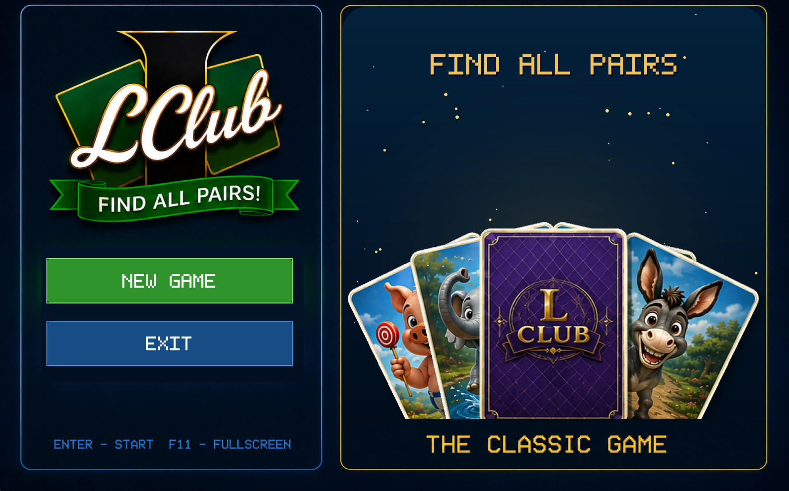
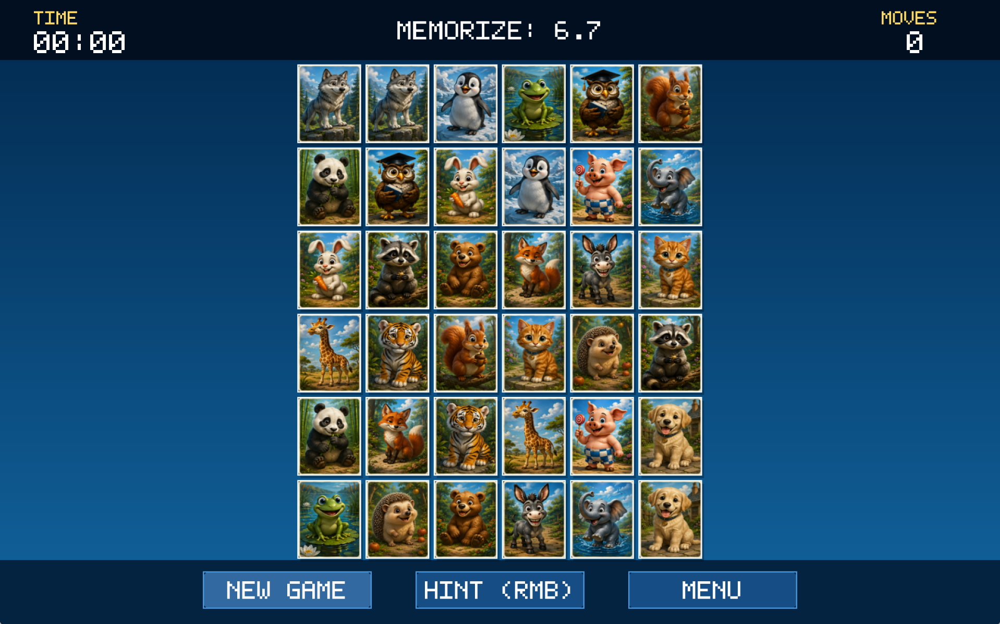

# LClub


[English](README.md)

**LClub** — современная кроссплатформенная версия моей классической карточной игры на развитие памяти для DOS, изначально написанной на **Turbo Pascal** в конце 1990-х годов.

Игровой процесс сохранился таким же, как в оригинальной версии, а код был полностью переписан на **Go** с использованием **Ebitengine**.

---

## Скриншоты





---

## Возможности

- Нативное настольное приложение
- Полностью написано на Go
- Не требует браузера
- Не требует веб-сервера
- Кроссплатформенность (Windows / Linux / macOS)
- Аппаратное ускорение отрисовки
- Поддержка полноэкранного режима
- Плавная анимация карточек
- Современные изображения высокого разрешения
- 18 уникальных карточек с животными
- Встроенные ресурсы (`go:embed`)
- Один исполняемый файл после компиляции

---

## Игровой процесс

Цель игры проста:

1. Игра создаёт поле из **36 карточек (18 пар)**.
2. Все карточки показываются на несколько секунд.
3. Затем карточки переворачиваются рубашкой вверх.
4. Игрок должен запомнить их расположение и найти все одинаковые пары.
5. Таймер запускается сразу после того, как карточки скрываются.
6. Игра заканчивается, когда найдены все пары.

Чем быстрее игрок закончит, тем лучше.

---

## Управление

| Действие            | Клавиша / кнопка мыши |
|---------------------|-----------------------|
| Начать игру         | **Enter**             |
| Новая игра          | **N**                 |
| Полноэкранный режим | **F11**               |
| Выход               | **Esc**               |
| Открыть карточку    | Левая кнопка мыши     |
| Временная подсказка | Правая кнопка мыши    |

---

## Правила игры

- На поле находятся **18 уникальных пар с изображениями животных**.
- Каждое животное встречается ровно два раза.
- Совпавшие карточки остаются открытыми.
- Несовпавшие пары автоматически скрываются после небольшой задержки.
- Во время начального показа видны все карточки.
- Обратный отсчёт отображается на **верхней информационной панели** и не перекрывает игровое поле.

---

## Интерфейс

По сравнению с оригинальной версией для DOS интерфейс был переработан:

- современное меню
- карточки высокого разрешения
- масштабируемый интерфейс
- плавная анимация
- улучшенное расположение элементов
- поддержка полноэкранного режима
- крупные, легко читаемые шрифты

Оригинальная жёлтая надпись **«LCLUB»** заменена графическим логотипом.

---

## Структура проекта

```
assets/
    cards/
        back.png
        card01.png
        ...
        card18.png

    ui/
        logo.png

font.go
main.go
README.md
go.mod
```

---

## Ресурсы

Все игровые ресурсы встроены непосредственно в исполняемый файл с помощью встроенной файловой системы Go.

```go
//go:embed assets/**
```

После компиляции внешние файлы не требуются.

---

## Сборка

```bash
go mod tidy
go mod build
```

## Зависимости

- Go 1.24+
- Ebitengine v2

---

## Лицензия

Этот проект — моя новая версия собственного школьного проекта.

Оригинальная версия для DOS:
Turbo Pascal (1998. Александр Сутулов)

Современная версия:
Go + Ebitengine
